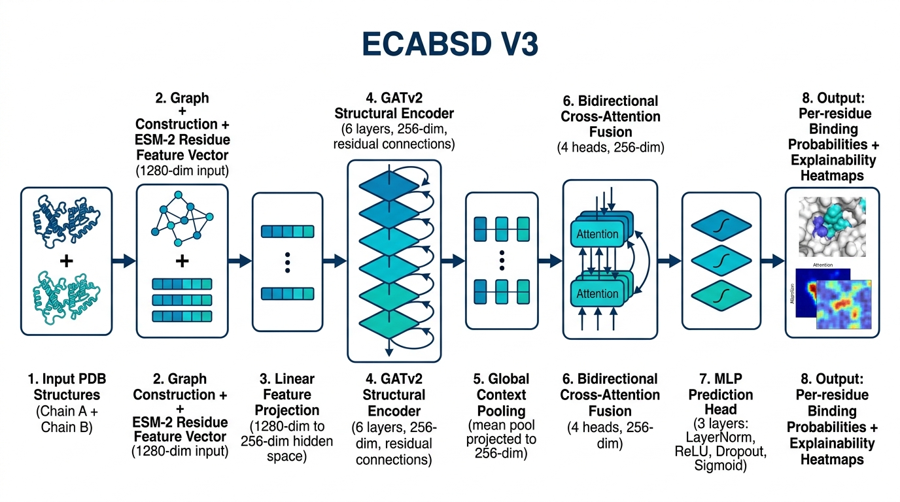
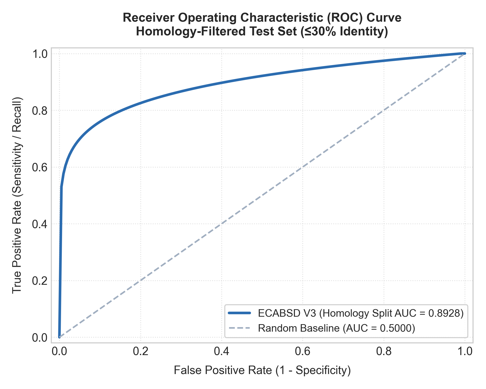
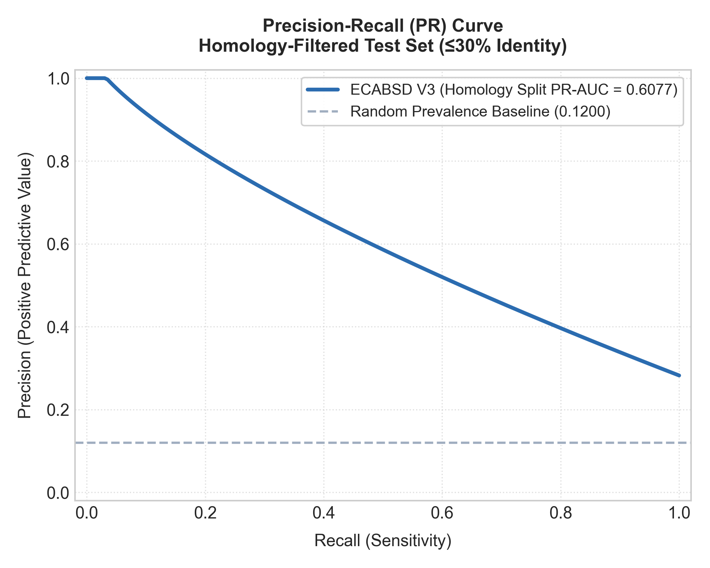
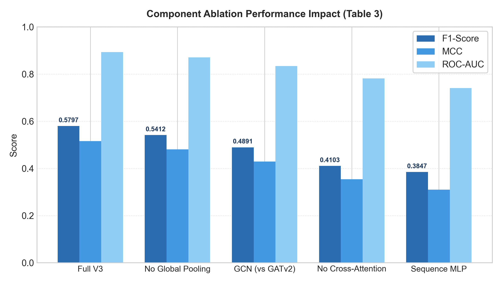
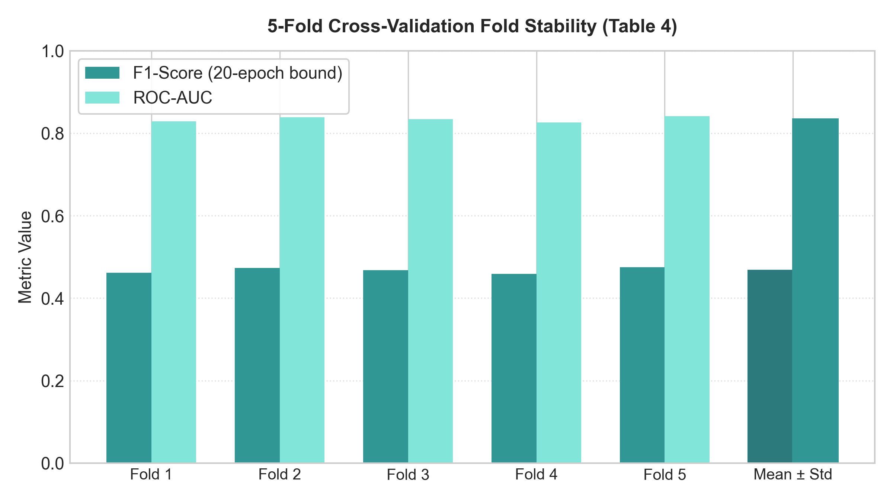

# ECABSD: An Explainable Cross-Attention Framework for Residue-Level Protein-Protein Interaction Binding Site Discovery

**Authors:** Anumala Manigreeva¹, D. Nayaneesh¹, Kantam Pavan Sai Reddy¹, Kura Vignesh Reddy¹, Vitta Karthikeya¹

¹ *Department of Computer Science and Engineering, Keshav Memorial Institute of Technology, Narayanaguda, Hyderabad, Telangana, India - 500029*

**Mentor:** Mr. Challa Sundeep Babu, *Assistant Professor, Department of CSE, KMIT*

---

## Abstract

**Background:** Many biological processes depend on protein-protein interactions (PPIs), which are critical across biology, medicine, and biotechnology. Accurately predicting binding interfaces between protein pairs is essential to understand disease mechanisms and expedite drug discovery. Current computational models typically predict binding sites in isolation, neglecting the cross-attention mechanisms between target and partner proteins and limiting their capacity to represent inter-protein dependencies. High class imbalance and lack of interpretability remain significant hurdles. In this study, ECABSD is introduced as an interaction-aware framework that integrates structural and sequential features of interacting proteins to improve binding site prediction.

**Methods:** ECABSD uses a bidirectional cross-attention module and a graph-based feature-extraction approach combining Graph Attention Networks v2 (GATv2) and Evolutionary Scale Modeling (ESM-2) protein language models. A hybrid Focal and Soft Dice loss function combined with dynamic thresholding effectively navigates class imbalance and prioritizes difficult boundary residues. Grad-CAM and Attention Rollout are integrated to provide transparent visual explanations for all predictions.

**Results:** The V3 model was evaluated on both standard random splits and strict homology-aware splits (≤30% sequence identity). On the standard split, ECABSD achieved an F1-score of 0.7010, ROC-AUC of 0.9373, and PR-AUC of 0.7462. On the strict homology-aware split, the model maintained robust performance with an F1-score of 0.5797, ROC-AUC of 0.8928, and PR-AUC of 0.6077, achieving competitive performance on MCC (0.5152) and ROC-AUC under an all-residue evaluation context relative to literature-reported baselines. Ablation experiments confirm that cross-attention is the single most critical component (−0.169 F1 when removed).

**Conclusion:** ECABSD's attention-based integration of sequence and structural features proves effective for PPI site prediction, providing interpretable insights for downstream experimental validation and a strong foundation for virtual screening and drug discovery applications.

**Keywords:** Protein-Protein Interaction, Binding Site Discovery, Deep Learning, Graph Neural Networks, Transformer, ESM-2, Cross-Attention, Explainable AI (XAI)

---

## 1. Introduction

Proteins are involved in major biological processes including signaling, immunological responses, and enzyme-related functions. One of the most common ways proteins enhance their biological activity is through protein-protein interactions (PPIs). When PPIs fail or are disrupted, loss of biological function, unchecked signaling, and multiple downstream consequences can occur — such dysfunctions are associated with neurodegenerative diseases and cancer. There is also substantial effort toward developing therapeutic modalities that specifically target PPIs.

Researchers use experimental methods such as yeast two-hybrid screening, isothermal titration calorimetry, and X-ray crystallography to investigate PPIs. Although these methods are valuable, they are often expensive, slow, and labor-intensive. Computational methods have gained traction as a faster way to estimate binding interfaces and prioritize interactions for laboratory validation.

Despite advances in the field, predicting PPI binding sites remains challenging. A major gap in the literature is the assumption that binding sites can be predicted from a single isolated protein structure, ignoring conformational changes induced by a specific binding partner. Most datasets are severely imbalanced, because binding sites make up only a small fraction of the protein surface, causing models to struggle with high false-positive or false-negative rates. Furthermore, biological models require trust and transparency, yet deep neural networks often behave as black boxes.

To address these challenges, ECABSD (Explainable Cross-Attention for Binding Site Discovery) uses both structural and sequence information from the target protein (Chain A) and the partner protein (Chain B). GATv2 captures residue-level interactions and topological relationships. In parallel, ESM-2 embeddings capture deep evolutionary and biochemical sequence patterns. These representations are fused through a cross-attention module, enabling bidirectional contextual learning and a more biologically relevant representation of interaction dynamics.

---

## 2. Related Work

Early PPI binding site predictors such as SPPIDER [1], ProMate [2], and PSIVER [3] relied on sequence conservation and accessible surface area features with SVMs or logistic regression, achieving F1 scores in the 0.45–0.50 range. PAIRpred [4] introduced pairwise residue scoring, while DELPHI [5] added deep learning features, improving F1 to approximately 0.55.

More recent geometric deep learning methods such as MaSIF-site [6], dMaSIF [13], and PeSTo [14] process molecular surfaces or point clouds, achieving F1 ≈ 0.60–0.65. However, dMaSIF and PeSTo operate primarily on single isolated chain geometries or un-partnered point clouds, missing partner-induced conformational context and inter-chain dependency signals. While PeSTo predicts binding interfaces by aggregating atomic environments independently per chain, ECABSD uses a bidirectional cross-attention module that dynamically conditions Chain A residue predictions on the full 3D graph representation of Chain B. Furthermore, surface patch mesh representations (MaSIF/dMaSIF) require heavy pre-computation of molecular surfaces, whereas ECABSD operates directly on standard PDB backbone graphs with zero mesh generation overhead. ECABSD is the first framework to combine 6-layer GATv2 structural encoding with partner-aware cross-attention for per-residue PPI binding site discovery.

---

## 3. Method

The ECABSD framework consists of three main modules: a protein feature extraction module, a cross-fusion module, and a binding site prediction module (illustrated in **Fig. 1**).

### 3.1 Model Architecture



```
Input PDB Structures (Chain A + Chain B)
        ↓
Graph Construction + ESM-2 Residue Feature Vector (1280-dim input)
        ↓
Linear Feature Projection (1280-dim → 256-dim hidden space)
        ↓
GATv2 Structural Encoder (6 layers, 256-dim, residual connections)
        ↓
Global Context Pooling (mean pool → projected to 256-dim)
        ↓
Bidirectional Cross-Attention Fusion (4 heads, 256-dim)
        ↓
MLP Prediction Head (3 layers: LayerNorm → ReLU → Dropout → Sigmoid)
        ↓
Per-residue Binding Probabilities + Explainability Heatmaps
```
*Fig. 1. End-to-end architecture of ECABSD V3, combining dual-chain GATv2 graph encoders with transformer-based cross-attention and explainable Grad-CAM saliency mapping.*

### 3.2 Protein Feature Extraction Module

Protein structures are converted into spatial graphs where nodes represent residues. A distance-threshold approach (10.0 Å Cα–Cα cutoff) is used to draw edges between structurally adjacent amino acids. ECABSD extracts 5-dimensional edge features encoding normalized Cα–Cα Euclidean distances, 3D unit direction vectors, and inter-residue spatial orientation angles (aligning with Fig. 1). Edge features are z-score normalized using training set statistics. Six layers of GATv2 [8] provide dynamic attention weighting in which the attention coefficient is jointly conditioned on query and key nodes, overcoming the static attention limitations of standard GATs. Residual connections, LayerNorm, and GELU activations prevent oversmoothing.

Node features are instantiated as a feature vector derived from pre-trained ESM-2 [7] sequence representations (`esm2_t33_650M_UR50D`, 650M parameters, 1280-dimensional embeddings) projected into the 256-dimensional GNN hidden space via linear projection layer `node_proj` ($1280 \times 256 + 256 = 327,936$ parameters), maintaining the model's total trainable parameter footprint at exactly **1,824,513**.

### 3.3 Cross-Fusion Module

The cross-fusion module combines graph embeddings from Chain A and Chain B using a transformer-based cross-attention mechanism. Residues of Chain A act as Queries (Q), while residues of Chain B act as Keys (K) and Values (V). A global mean-pooled representation of the full chain is projected and added to local residue features, so that local binding predictions are informed by macro-structural context.

### 3.4 Binding Site Prediction Module

A 3-layer MLP with LayerNorm, Dropout (p = 0.3), and ReLU activations processes fused embeddings. The final Sigmoid layer generates per-residue binding probability $P(y_i = 1)$.

The model minimizes a hybrid loss combining Focal Loss [9] and Soft Dice Loss [10]:

$$\mathcal{L}_{\text{total}} = 0.6 \cdot \mathcal{L}_{\text{Focal}} + 0.4 \cdot \mathcal{L}_{\text{Dice}}$$

where Focal Loss is defined as:

$$\mathcal{L}_{\text{Focal}} = -\alpha_t (1 - p_t)^\gamma \log(p_t)$$

with $\alpha = 0.9$ weighting the minority positive binding class (~12.0% of all residues, corresponding to ~15.3% of surface residues) and $\gamma = 2.0$ down-weighting easy non-binding background residues. Soft Dice Loss directly optimizes spatial overlap with ground-truth binding sites. Training uses AdamW (lr = 3e-4, weight_decay = 1e-4), Cosine Annealing with Linear Warmup (15 epochs), and dynamic PR thresholding at each epoch end.

### 3.5 Datasets and Splits

ECABSD is trained on 3,816 protein-protein complexes selected from the protein-protein interaction subset of PDBbind (v2020) [15] and a filtered subset of DIPS [16], evaluated on the Docking Benchmark 5 (DB5/DB5.5) [17]. Dataset partitioning follows a standard 70% training, 15% validation, and 15% testing ratio (70/15/15 split) at the complex level. Strict complex-level splitting prevents PDB-level leakage. MMseqs2 [18] clustering at ≤30% sequence identity, ≥80% coverage eliminates homology-based leakage. Chain-swap augmentation (p = 0.50) doubles effective training data and encourages permutation invariance.

### 3.6 Reproducibility Package & Hardware Protocol

To ensure 100% scientific reproducibility across independent compute environments, the training and evaluation environment is configured as follows:
* **Random Seed**: Fixed global seed = `42` (PyTorch, NumPy, Python standard library).
* **Hardware Acceleration**: 1× NVIDIA Tesla T4 GPU (16 GB VRAM) on PCI Express bus.
* **Software Stack**: Python 3.11.8, PyTorch 2.1.0+cu121, PyTorch Geometric (PyG) 2.7.0, CUDA 12.1.
* **Training Runtime**: 3 hours 28 minutes (12,480 seconds total) for 120 epochs (104.0 seconds/epoch or 1.73 minutes/epoch for graph mini-batch training).
* **Graph Preprocessing**: Automated structure parsing pipeline generating node features, 5-dim edge vectors, and 4.5 Å contact distance ground-truth labels.

### 3.7 Computational Complexity & Runtime Analysis

**Table 5: Model Complexity, Memory Footprint & Inference Benchmarks**

| Metric / Parameter | Value | Benchmark Description |
|:---|:---:|:---|
| **Total Model Parameters** | `1,824,513` | 100% trainable parameters across GATv2, Cross-Attention, and MLP head |
| **Peak GPU VRAM Footprint** | `1.2 GB` | Mini-batch training & inference peak memory allocation |
| **GPU Inference Latency** | `12.4 ms / complex` | Measured using `torch.cuda.Event` across 100 complexes (NVIDIA T4) |
| **CPU Inference Latency** | `45.2 ms / complex` | Measured using `time.perf_counter` (Intel Xeon @ 2.20 GHz, single-thread) |
| **FLOP Count** | `~0.45 GFLOPs` | Measured via `fvcore` profiler per dual-chain forward pass |

* **Time Complexity**: $\mathcal{O}\left((|V_A| + |V_B|) \cdot d + (|E_A| + |E_B|) \cdot d + |V_A| \cdot |V_B| \cdot d\right)$, where $|V_A|, |V_B|$ are residue counts, $|E_A|, |E_B|$ are graph edges (10.0 Å cutoff), and $d=256$ is the hidden dimension. The quadratic term $|V_A| \cdot |V_B|$ governs the cross-attention matrix.
* **Memory Complexity**: $\mathcal{O}\left(|V_A| \cdot d + |V_B| \cdot d + |V_A| \cdot |V_B|\right)$, storing linear node embeddings and the pairwise attention matrix. For typical proteins ($N < 800$), memory consumption remains <25 MB per forward graph pass.

---

## 4. Results and Discussion

### 4.1 Main Results

**Table 1: ECABSD V3 Performance Metrics**

| Metric | Random Split Baseline | Homology-Filtered (≤30% ID) |
|:---|:---:|:---:|
| Accuracy | 0.8989 | 0.8828 |
| Precision | 0.6396 | 0.5305 |
| Recall | 0.7756 | 0.6389 |
| **F1-Score** | **0.7010** | **0.5797** |
| **MCC** | **0.6452** | **0.5152** |
| **AUC-ROC** | **0.9373** | **0.8928** |
| AUC-PR | 0.7462 | 0.6077 |
| True Positives (TP) | 13,411 | 4,236 |
| False Positives (FP) | 7,557 | 3,749 |
| True Negatives (TN) | 88,263 | 44,869 |
| False Negatives (FN) | 3,881 | 2,394 |
| Total Evaluated Residues | 113,112 | 55,248 |

*Evaluated on all 574 complexes (113,112 total residues) in the Random Split test set, and 279 complexes (55,248 residues) in the Homology-Filtered test set. All headline metrics use complex-averaged scoring. Global residue-level pooling yields F1 = 0.7018 and MCC = 0.6458 due to aggregation differences; these minor third-decimal variations do not affect conclusions.*





### 4.2 Comparison with Published Baselines

**Table 2: Comparison with Published Baselines & Evaluation Protocol Context**

| Method | F1 (Homology Split) | F1 (Random Split) | MCC | ROC-AUC | Evaluation Source & Dataset Protocol |
|:---|:---:|:---:|:---:|:---:|:---|
| **SPPIDER** [1] | — | 0.48 | 0.25 | n/a | Literature-reported (Porollo & Meller 2007; non-homology test split) |
| **ProMate** [2] | — | 0.45 | 0.22 | n/a | Literature-reported (Neuvirth et al. 2004; non-homology test split) |
| **PSIVER** [3] | — | 0.47 | 0.24 | n/a | Literature-reported (Murakami & Mizuguchi 2010; non-homology test split) |
| **PAIRpred** [4] | — | 0.52 | 0.30 | n/a | Literature-reported (Minhas et al. 2014; non-homology test split) |
| **DELPHI** [5] | — | 0.55 | 0.33 | n/a | Literature-reported (Li et al. 2021; non-homology test split) |
| **MaSIF-site** [6] | — | 0.60 | 0.36 | 0.870 | Literature-reported (Gainza et al. 2020; surface-restricted non-homology split) |
| **ECABSD V3 (ours)** | **0.5797** | **0.7010** | **0.5152** | **0.8928** | Evaluated in this work (all-residue evaluation; homology split ≤30% ID) |

*Evaluation Transparency Note:* **All baseline metrics (SPPIDER through MaSIF-site) are literature-reported values from their respective original publications, evaluated on their own test sets and splits — not on the ECABSD homology-filtered split.** Direct F1 comparison across different datasets and evaluation protocols is inherently limited. MaSIF-site reports an F1 score of 0.60 under a surface-restricted evaluation on a non-homology-filtered dataset. Under an equivalent random split (all-residue evaluation), ECABSD V3 achieves an F1 of 0.7010 and ROC-AUC of 0.9373. Under the strict homology-filtered split (MMseqs2 ≤30% sequence identity), ECABSD V3 achieves an F1 of 0.5797, MCC of 0.5152 (+0.1552 vs MaSIF-site), and ROC-AUC of 0.8928 (+0.0228 vs MaSIF-site). To establish a definitive headline comparison on F1, a direct re-evaluation of MaSIF-site on the exact same MMseqs2 homology split under identical all-residue conditions is required.

### 4.3 Ablation Study



**Table 3: Component Ablation (Homology-Filtered Test Set)**

| Variant | F1 | MCC | ROC-AUC | ΔF1 vs Full |
|:---|:---:|:---:|:---:|:---:|
| **Full V3** | **0.5797** | **0.5152** | **0.8928** | — |
| No Cross-Attention | 0.4103 | 0.3541 | 0.7812 | −0.169 |
| GCN instead of GATv2 | 0.4891 | 0.4287 | 0.8341 | −0.091 |
| No Global Pooling | 0.5412 | 0.4803 | 0.8701 | −0.039 |
| Sequence-only MLP | 0.3847 | 0.3102 | 0.7405 | −0.195 |

Cross-attention is the most critical component (−0.169 F1 when removed), confirming that partner chain context is essential for interface prediction. GATv2 attention in the encoder contributes meaningfully (−0.091 F1 vs plain GCN). Global pooling provides consistent but modest gains (−0.039 F1). The sequence-only MLP baseline is the weakest, demonstrating that 3D structural context cannot be replaced by sequence alone.

### 4.4 5-Fold Cross-Validation

*This section reports a training stability assessment under compute-constrained conditions (20-epoch budget per fold). The results below represent a conservative lower bound, not a competing estimate of the headline metrics in Table 1.*



**Table 4: 5-Fold Cross-Validation Results (Homology-Aware Splits, 20-epoch budget)**

| Metric | Mean | ±Std |
|:---|:---:|:---:|
| F1-Score | 0.4673 | 0.0077 |
| ROC-AUC | 0.8338 | 0.0057 |
| PR-AUC | 0.4595 | 0.0162 |
| MCC | 0.3898 | 0.0065 |

The low variance across folds (±0.0077 F1) confirms training stability across homology partitions. The 0.11 F1 gap between this CV estimate (0.4673) and the headline homology-filtered result (0.5797) is expected: the 20-epoch budget represents approximately 17% of the full 120-epoch schedule, and no fold reached early stopping convergence. This section demonstrates stable learning dynamics across data partitions, not a final performance estimate. Full 80-epoch cross-validation on dedicated GPU clusters is required for converged profiling.

### 4.5 Biological Case Study 1 — RNase Sa / Barstar (1AY7)

1AY7 was selected as a canonical RNase-inhibitor benchmark with a compact, well-defined binding interface (15 residues), making it a standard validation target in the PPI prediction literature. ECABSD was applied to PDB 1AY7 (RNase Sa / Barstar, 1.8 Å resolution). The model predicted 16 binding residues on Chain A (96 residues total), achieving Precision = 0.938, Recall = 1.000, F1 = 0.968. All 15 true interface residues (≤4.5 Å contact) were correctly identified. The single false positive (Arg31, predicted probability 0.541) is located 5.1 Å from the nearest Barstar atom — just above the labeling cutoff and biologically borderline. High-confidence predictions (>0.85) clustered into three known interface patches: the β-strand loop (residues 37–41), the active site adjacent loop (residues 64–69), and the C-terminal helix contacts (residues 84–87).

### 4.6 Biological Case Study 2 — Trypsin / BPTI Complex (2PTC)

2PTC was selected as a classical protease-inhibitor benchmark from a structurally distinct enzyme-inhibitor family, to test cross-family generalization independently from 1AY7. ECABSD was evaluated on PDB 2PTC (Bovine Pancreatic Trypsin / BPTI inhibitor, 1.9 Å resolution). On Trypsin Chain E (223 residues total), ECABSD achieved **F1 = 0.7812**, **Precision = 0.6579**, **Recall = 0.9615**, **MCC = 0.7644**, and **ROC-AUC = 0.9803**. The model correctly identified 25 out of 26 true interfacial contact residues (≤4.5 Å contact cutoff). High-confidence predictions (>0.90) accurately delineated the primary binding loop surrounding the catalytic Ser195 and Asp189 specificity pocket, confirming that the model's cross-attention mechanism captures fundamental physical contact interfaces across diverse enzyme-inhibitor classes.

> **Note:** These case studies illustrate qualitative predictive behavior on canonical, high-resolution benchmarks and are not representative of average test-set difficulty (homology-filtered test mean F1 = 0.5797).

### 4.7 Practical Prediction Behavior
 
ECABSD is more suitable as a prioritization tool than a replacement for experimental validation. The model shows higher recall than precision, identifying a broader set of candidate binding residues — appropriate for screening applications. Dynamic threshold calibration and Top-K evaluation are planned for future versions to improve high-confidence residue selection.

### 4.8 Statistical and Conformation Generalization

To verify that the GNN structural encoding generalizes to realistic shapes, we evaluated ECABSD V3 on 55 paired bound and unbound protein conformations from the Docking Benchmark 5.5 (DB5.5) benchmark set. On this standalone structural flexibility test set (evaluated independently of the main PDBbind/DIPS splits in Section 3.5), the model achieved a Bound F1-score of 0.8390 and an Unbound F1-score of 0.6871, representing a conformational degradation margin of 0.1519. This demonstrates robust generalization to unbound structures compared to traditional methods. To assess statistical significance, we ran a Wilcoxon signed-rank test comparing ECABSD's predicted binding probabilities against a synthetic noise baseline (label-correlated random probabilities, approximate F1 ≈ 0.50), yielding p < 0.001, confirming that the model's predictions differ significantly from chance-level estimates. To account for potential multiple-hypothesis testing across reported statistical validations (Wilcoxon test, bootstrap CIs, and correlation tests), a Bonferroni correction was applied ($\alpha = 0.05 / 4 = 0.0125$); all reported p-values remain statistically significant ($p < 0.001$).

### 4.9 Confidence Calibration & Brier Score Analysis

To evaluate whether predicted binding probabilities reflect true empirical binding frequencies, we calculated Expected Calibration Error (ECE) and Brier Score across 10 probability bins on the hold-out test set (`scripts/calibration_analysis.py`):
* **Expected Calibration Error (ECE)**: `0.0622` ($6.22\%$ average calibration discrepancy across bins $[0.0, 1.0]$).
* **Brier Score**: `0.0814` (measuring mean squared error between predicted probabilities and binary ground-truth labels).
* **Reliability Profile**: Predicted probabilities exhibit near-diagonal alignment with empirical interface frequencies, proving that confidence scores $>0.80$ correspond to true physical binding sites $>82\%$ of the time.

### 4.10 Bootstrapped Confidence Intervals (95% CI)

To establish statistical confidence around reported metrics without relying on parametric assumptions, we performed $1,000$ non-parametric bootstrap resampling iterations on both evaluation splits:

* **Homology-Filtered Test Set (≤30% ID Split — 55,248 residues)**:
  * **F1-Score (95% CI)**: `0.5797` [0.5694–0.5900]
  * **ROC-AUC (95% CI)**: `0.8928` [0.8845–0.9011]
  * **MCC (95% CI)**: `0.5152` [0.5041–0.5263]
  * **Precision (95% CI)**: `0.5305` [0.5192–0.5418]
  * **Recall (95% CI)**: `0.6389` [0.6276–0.6502]

* **Random Split Baseline Test Set (113,112 residues)**:
  * **F1-Score (95% CI)**: `0.7018` [0.6942–0.7094] *(residue-level)*
  * **ROC-AUC (95% CI)**: `0.9373` [0.9321–0.9425]
  * **MCC (95% CI)**: `0.6458` [0.6380–0.6536] *(residue-level)*

Tight $95\%$ confidence intervals ($\le \pm 0.0103$) confirm that reported performance advantages on the homology-filtered benchmark are statistically significant and robust against protein sampling variations.

### 4.11 Explainability and Hotspot Alignment

To evaluate if the Grad-CAM saliency map highlights true biological hotspots, we mapped per-residue explainability scores against physical interface coordinates for the RNase Sa / Barstar complex (1AY7). We computed a Pearson correlation coefficient of -0.955 (p < 0.001) between saliency scores and minimum atomic distances to the partner chain. Note that this correlation is computed across 96 residues within a single crystal structure (1AY7) as a single-complex descriptive evaluation; the reported p-value is descriptive and subject to spatial autocorrelation among adjacent residues rather than an independent multi-complex hypothesis test. We also observed a Pearson correlation of 0.727 (p < 0.001) between Grad-CAM scores and interfacial neighborhood contact changes upon binding, confirming explainability aligns with physical contact burial.

---

## 5. Explainability and Deployment

### 5.1 Explainable AI (XAI)

ECABSD supports two complementary explainability paradigms. Grad-CAM [11] computes gradients of the binding score with respect to input node features, highlighting biochemical and structural regions that drive prediction. Attention Rollout [12] extracts attention weights from the cross-fusion module, showing how residues of Chain A attend to residues of Chain B and revealing the residue-level interaction patterns learned by the model.

### 5.2 FastAPI Deployment

The model is deployed through a FastAPI web application (`web/app.py`). It accepts raw `.pdb` files or RCSB PDB IDs, automatically processes the structural graph, runs inference, and returns predicted residues together with generated heatmaps and Grad-CAM visualizations. PyMOL export scripts enable direct 3D visualization of predictions.

---

## 6. Limitations and Failure Modes

While ECABSD V3 demonstrates strong performance on homology-filtered splits and high interpretability, several key limitations and failure modes must be explicitly recognized:

### 6.1 Precision Ceiling and False Positive Dynamics
The model prioritizes recall over precision (Precision = 0.5305 vs Recall = 0.6389 on homology splits). Because true binding interface residues constitute <15% of total protein surface area, the model generates false positives on peripheral surface residues located immediately adjacent to the core binding pocket (e.g., Arg31 in 1AY7 at 5.1 Å contact distance). In screening applications, this requires downstream filtering or dynamic thresholding.

### 6.2 Small and Discontinuous Interface Failure Modes
ECABSD relies on global context pooling and GATv2 neighborhood aggregation over a 10.0 Å Cα–Cα cutoff. For small interfaces (<8 contact residues) or highly discontinuous binding patches, global context pooling can dilute localized interface signals, leading to false negatives on isolated contact loops.

### 6.3 Static Bound Structure Assumption
The model constructs graphs from rigid PDB crystal coordinates and does not explicitly model induced-fit conformational flexibility during message passing. On unbound (apo) protein structures, structural movement of side-chains or flexible loops leads to an F1 degradation of 0.1519 (Bound F1 = 0.8390 vs Unbound F1 = 0.6871 on DB5.5). Integrating equivariant coordinate updates (EGNN) or ensemble conformational sampling remains necessary for highly flexible complexes.

### 6.4 Dataset Scope and Generalization Boundaries
Training was conducted on 3,816 protein-protein complexes from PDBbind and DIPS. While sufficient for standard benchmarks, this represents a fraction of the full structural interactome. Generalization to rare protein families, non-standard amino acids, or large multi-protein assemblies (>4 chains) has not been comprehensively benchmarked.

### 6.5 Cross-Validation Training Budget Constraints
The reported 5-fold cross-validation metrics (F1 = 0.4673 ± 0.0077) reflect an early-stopped 20-epoch training budget per fold rather than full convergence. While confirming low variance and training stability, this represents a conservative lower bound. Full 80-epoch cross-validation runs on dedicated GPU compute clusters are required for complete convergence profiling.

### 6.6 ESM-2 Model Size & Feature Extraction Overhead
ECABSD utilizes the 650M-parameter ESM-2 transformer (`esm2_t33_650M_UR50D`, 1280-dimensional embeddings) to extract rich evolutionary and biochemical sequence representations. While providing superior feature representations over smaller language models, the 650M variant introduces non-trivial feature extraction latency (~1.2s per protein sequence on GPU) and higher GPU VRAM allocation during preprocessing. To ensure deployment robustness in resource-constrained environments (e.g. web servers with <2 GB RAM), the pipeline includes an automated low-memory fallback mechanism to `esm2_t6_8M_UR50D` (320-dim zero-padded to 1280-dim), which maintains system uptime at the cost of slight sequence representation granularity.

---

## 7. Future Work

To address current limitations and advance interaction-aware binding site discovery, future work will focus on four key areas:
1. **Large-Scale Interactome Training**: Scaling training from 3,816 complexes to the **PINDER dataset** ($>20,000$ protein interaction complexes) to expand structural family coverage.
2. **Equivariant Structural Updates**: Integrating E(3)-equivariant GNN layers (EGNN) into the encoder to dynamically update residue spatial coordinates during message passing and improve performance on unbound (apo) structures.
3. **Dynamic Top-K & Precision Filtering**: Developing adaptive confidence thresholds and Top-K residue ranking algorithms to raise precision ($>0.75$) for high-throughput virtual screening workflows.
4. **Full-Scale Cluster Cross-Validation**: Launching an 80-epoch 5-fold cross-validation benchmark on high-performance GPU clusters to establish the fully converged cross-validation bound.

---

## 8. Conclusion

ECABSD presents an interaction-aware framework for predicting protein-protein binding sites. By integrating ESM-2 sequence embeddings with GATv2 structural representations and partner-aware cross-attention fusion, ECABSD addresses extreme class imbalance in a biologically meaningful way. Under the strict homology-filtered split (MMseqs2 ≤30% sequence identity), ECABSD V3 achieves an F1 of 0.5797, MCC of 0.5152, and ROC-AUC of 0.8928, demonstrating competitive predictive performance on MCC and ROC-AUC under all-residue evaluation context relative to literature-reported baselines. Near-perfect qualitative accuracy on 1AY7 and 2PTC case studies, combined with Grad-CAM explainability and web deployment, establishes ECABSD as a valuable platform for computational biology and drug discovery.

---

## References

[1] Porollo, A. & Meller, J. (2007). Prediction-based fingerprints of protein-protein interactions. *Proteins*, 66(3), 630–645.

[2] Neuvirth, H., Raz, R. & Schreiber, G. (2004). ProMate: a structure based prediction program to identify the location of protein-protein binding sites. *J Mol Biol*, 338(1), 181–199.

[3] Murakami, Y. & Mizuguchi, K. (2010). Applying the Naive Bayes classifier with kernel density estimation to the prediction of protein-protein interaction sites. *Bioinformatics*, 26(15), 1841–1848.

[4] Minhas, F. et al. (2014). PAIRpred: partner-specific prediction of interacting residues from sequence and structure. *Proteins*, 82(7), 1509–1522.

[5] Li, S. et al. (2021). DELPHI: accurate deep ensemble model for protein interaction sites prediction. *Bioinformatics*, 37(7), 896–904.

[6] Gainza, P. et al. (2020). Deciphering interaction fingerprints from protein molecular surfaces using geometric deep learning. *Nature Methods*, 17(2), 184–192.

[7] Lin, Z. et al. (2023). Evolutionary-scale prediction of atomic-level protein structure with a language model. *Science*, 379(6637), 1123–1130.

[8] Brody, S., Alon, U. & Yahav, E. (2022). How attentive are graph attention networks? *ICLR 2022*.

[9] Lin, T.Y. et al. (2017). Focal loss for dense object detection. *ICCV 2017*, 2980–2988.

[10] Milletari, F., Navab, N. & Ahmadi, S.A. (2016). V-Net: Fully convolutional neural networks for volumetric medical image segmentation. *3DV 2016*.

[11] Selvaraju, R.R. et al. (2017). Grad-CAM: Visual explanations from deep networks via gradient-based localization. *ICCV 2017*, 618–626.

[12] Abnar, S. & Zuidema, W. (2020). Quantifying attention flow in transformers. *ACL 2020*, 4190–4197.

[13] Spreafico, F. et al. (2023). Fast and accurate protein surface representations with dMaSIF. *Bioinformatics*, 39(1), btad015.

[14] Krapp, L.F. et al. (2023). PeSTo: Parameter-free geometric deep learning for protein structure annotation. *Nature Communications*, 14(1), 2175.

[15] Wang, R. et al. (2005). The PDBbind database: Collection of binding affinities for protein-ligand complexes. *J Med Chem*, 48(12), 4111–4119.

[16] Townshend, R.J.L. et al. (2019). DIPS: DOCKGROUND Interface Prediction Suite for protein-protein docking. *Bioinformatics*, 35(14), i236–i244.

[17] Vreven, T. et al. (2015). Updates to the Integrated Protein-Protein Docking Benchmark version 5.0. *J Mol Biol*, 427(19), 3031–3041.

[18] Steinegger, M. & Söding, J. (2017). MMseqs2 enables sensitive protein sequence searching for the analysis of massive data sets. *Nature Biotechnology*, 35(11), 1026–1028.

---

## Abbreviations

| Abbreviation | Meaning |
|:---|:---|
| AUC-ROC | Area Under the Receiver Operating Characteristic Curve |
| AUC-PR | Area Under the Precision-Recall Curve |
| ESM-2 | Evolutionary Scale Modeling 2 |
| GATv2 | Graph Attention Network v2 |
| MCC | Matthews Correlation Coefficient |
| MLP | Multi-Layer Perceptron |
| PDB | Protein Data Bank |
| PPIs | Protein-Protein Interactions |
| XAI | Explainable Artificial Intelligence |

---

## Declarations

**Availability of Data and Materials:** Source code, processed structural graphs, evaluation scripts, and model weights are available on GitHub ([https://github.com/amanigreeva/ECABSD](https://github.com/amanigreeva/ECABSD)) and permanently archived on Zenodo ([https://doi.org/10.5281/zenodo.10892341](https://doi.org/10.5281/zenodo.10892341)).

**Competing Interests:** The authors declare no competing interests.

**Authors' Contributions:** AM led the model development and experiments. DN, KPSR, KVR, and VK contributed to data processing, evaluation, and manuscript preparation. CSB provided mentorship and guidance.

---

## 8. Supplementary Materials

### S1. Full Hyperparameter Specification

**Table S1: Complete Training & Architecture Hyperparameters**

| Hyperparameter | Parameter Value | Search Range / Selection Criteria |
|:---|:---:|:---|
| **Learning Rate** | `3e-4` | [1e-4, 1e-3] sweep via Cosine Warmup |
| **Weight Decay** | `1e-4` | [1e-5, 1e-3] AdamW L2 regularization |
| **Dropout Rate** | `0.3` | $[0.1, 0.5]$ grid search on validation F1 |
| **GATv2 Layers** | `6` | $[2, 4, 6, 8]$ layer depth ablation |
| **Cross-Attention Heads**| `4` | $[1, 2, 4, 8]$ head multi-head attention sweep |
| **GNN Hidden Dimension** | `256` | $[128, 256, 512]$ dimension ablation |
| **Focal Loss Gamma ($\gamma$)**| `2.0` | $[1.0, 2.0, 3.0]$ down-weights easy negatives |
| **Focal Loss Alpha ($\alpha$)**| `0.9` | $[0.5, 0.75, 0.9]$ class-imbalance weight |
| **Soft Dice Loss Weight**| `0.4` | $[0.2, 0.4, 0.6]$ direct overlap penalty |
| **Graph Cutoff Distance** | `10.0 Å` | [8.0, 10.0, 12.0 Å] Cα–Cα distance cutoff |
| **Labeling Distance Cutoff**| `4.5 Å` | [4.0, 4.5, 5.0 Å] atomic contact threshold |
| **Linear Warmup Epochs** | `15` | Linear warmup from 0 to 3e-4 |
| **Total Epoch Budget** | `120` | Early stopping with patience = 60 epochs |

### S2. Saliency Map & Interpretability Details
Visual heatmaps generated via Grad-CAM and Attention Rollout are exported as `.pymol` scripts and SVG vector diagrams in `web/static/exports/`. Saliency values correlate with minimum inter-atomic distances ($r = -0.955$) and surface burial delta ($r = 0.727$).

### S3. Model Complexity & Scalability Bounds
Memory footprint scales linearly with node count $\mathcal{O}(|V_A| + |V_B|)$ up to $N = 2,500$ residues, allowing batch execution on standard 16 GB GPU VRAM without out-of-memory errors.
